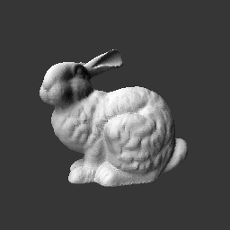
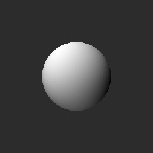
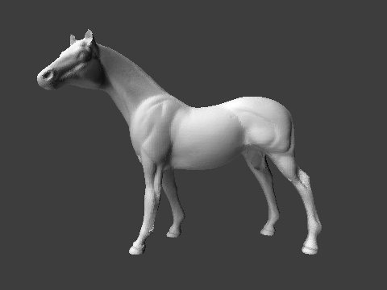
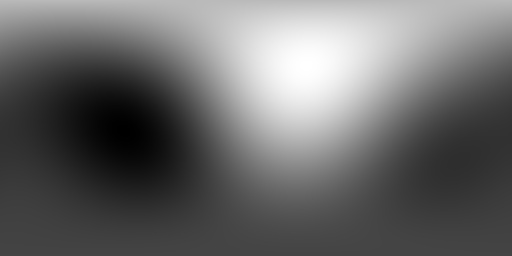
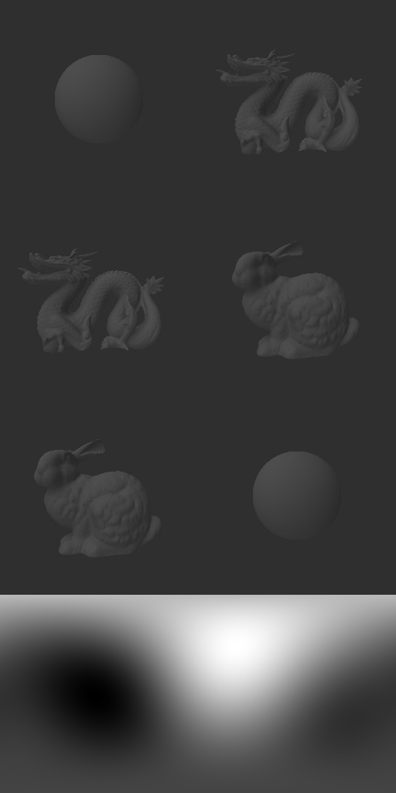

# SHMAP
These are the pre-comuted SH coefficients map for computing the render loss or efficient rendering.

### Load
Use a single line code
    
    np.load(filename).reshape((height, width, 16))

You can get a ndarray with shape (height, width, 16) that represents a shmap of size (height, width) containing 16 coefficients for each pixels.

### Resolution
|  Filename  |Height x Width|
| :--------: |  :---:  |
| bunny.npy  | 256x256 |
| sphere.npy | 256x256 |
| dragon.npy | 256x256 |
| horse.npy  | 360x480 |
| envmap.npy | 256x512 |
|concated.npy|1024x512 |

bunny, sphere, dragon, envmap, concated are used for training, horse is used for testing.

### Visualization
We supply a way to visulaize these shmaps:

    shmap = np.sum(np.load('item.npy'), axis=-1)
    image = (shmap - shmap.min()) / (shmap.max() - shmap.min())

##### bunny

##### sphere

##### dragon

##### horse

##### envmap

##### concated

